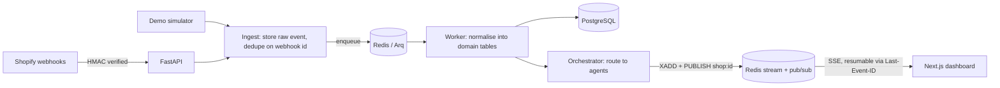

# StoreOps AI

Real-time AI operations team for Shopify stores. Agents watch orders, inventory, abandoned carts,
reviews and support in real time, act within seconds, and route anything risky to the merchant for
approval on a live dashboard.

> 🚧 Under active development. See [docs/product-spec.md](docs/product-spec.md) for the full
> specification and milestones.

## Stack

FastAPI · SQLAlchemy (async) · PostgreSQL 16 · Redis 7 · Arq · Next.js 16 · Tailwind v4 · shadcn/ui ·
Server-Sent Events · OpenRouter



The browser only talks to the Next.js origin; `/api/*` (including the SSE stream) is proxied to
FastAPI so the session cookie stays first-party.

### Real-time pipeline

1. **Ingest:** the raw payload goes into `webhook_events`, deduplicated on the delivery id, and a job
   is enqueued. Nothing else happens on the request path.
2. **Normalise:** the worker upserts orders, customers, checkouts, variants, inventory, reviews and
   tickets. Handlers are idempotent and skip payloads older than the stored `updated_at`, so
   duplicate and out-of-order deliveries are harmless. A failing event is marked `failed` with
   the error and doesn't block others.
3. **Route:** the orchestrator publishes each domain change to the shop's event stream, hands it to
   the subscribed agents and writes a human-readable activity line explaining why it matters.
4. **Stream:** every event gets a Redis stream id. The dashboard loads a snapshot
   (`GET /api/shops/{id}/dashboard`) and then opens `GET /api/shops/{id}/events/stream` from the
   snapshot's `last_event_id`. On reconnect the browser sends `Last-Event-ID` and missed events are
   replayed. If the stream can't be held open, the client falls back to polling
   `GET /api/shops/{id}/events?after=…`.

## Demo mode

The **Northbound Outdoor Gear** demo store is seeded with a 12-product, 30-variant catalog, 320 customers and
five weeks of order history, so KPIs and week-over-week comparisons make sense from the first
minute. While someone is watching the dashboard, the simulator streams:

- checkouts every few seconds, about half of which convert into orders with matching stock updates
- the occasional suspicious order (new customer, billed abroad, unusual quantity, payment pending)
- reviews, support emails, fulfilments and restocks

Use **Trigger scenario** to fire a flash sale spike, fraud attempt, stockout, angry review or
shipping delay. **Pause demo traffic** stops the simulator. Simulated events go through the same
ingest pipeline as real webhooks. Demo mode needs no API keys and never contacts Shopify or sends
email.

## Quick start

Requirements: Docker with Compose v2.

```bash
cp .env.example .env
make dev
```

| Service | URL |
|---|---|
| Web app | http://localhost:3000 |
| API docs (OpenAPI) | http://localhost:8000/docs |
| Health / readiness | http://localhost:8000/health · http://localhost:8000/ready |

Sign up, then choose **Launch demo store** on the onboarding screen. Demo mode needs no API keys and
never sends anything externally.

### Without Docker

Requires Python 3.12 with [uv](https://docs.astral.sh/uv/), Node 22, PostgreSQL 16 and Redis 7.

```bash
make install
make infra      # or point DATABASE_URL / REDIS_URL at your own services
make migrate
make api        # terminal 1
make worker     # terminal 2
make web        # terminal 3
```

## Development

```bash
make lint     # ruff, mypy, eslint, tsc, prettier
make test     # pytest with coverage (needs a storeops_test database) + vitest
make e2e      # Playwright against a running stack
make help     # all targets
```

## Repository layout

| Path | Contents |
|---|---|
| `backend/` | FastAPI app, SQLAlchemy models, Alembic migrations, Arq worker, tests |
| `frontend/` | Next.js App Router dashboard and design system |
| `docs/` | Product and technical specification |

## Security model (so far)

- Session auth: opaque random token in an `httpOnly`, `SameSite=Lax` cookie; sessions live in Redis
  keyed by the token's SHA-256.
- CSRF: per-session synchroniser token sent as `X-CSRF-Token` on every unsafe request, plus an
  `Origin` allow-list.
- RBAC per shop: `owner` > `admin` > `viewer`. Non-members receive 404 so shop ids can't be probed.
- Argon2id password hashing, constant-time login path, rate-limited auth endpoints.
- Shopify access tokens are encrypted at rest with Fernet (`TOKEN_ENCRYPTION_KEY`).
- `audit_log` is append-only, enforced by a database trigger.
