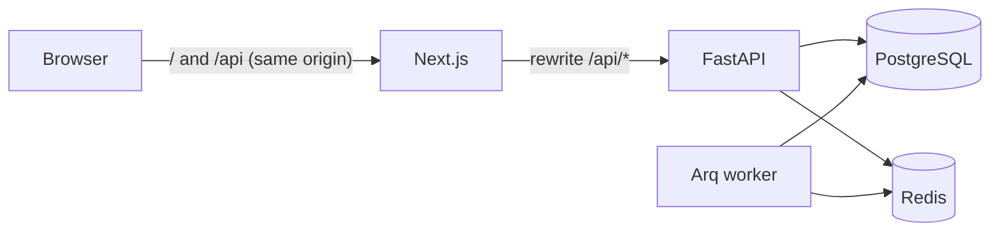

# StoreOps AI

Real-time AI operations team for Shopify stores. Agents watch orders, inventory, abandoned carts,
reviews and support in real time, act within seconds, and route anything risky to the merchant for
approval on a live dashboard.

> 🚧 Under active development. See [docs/product-spec.md](docs/product-spec.md) for the full
> specification and milestones.

## Stack

FastAPI · SQLAlchemy (async) · PostgreSQL 16 · Redis 7 · Arq · Next.js 16 · Tailwind v4 · shadcn/ui ·
Server-Sent Events · OpenRouter



## Quick start

Requirements: Docker with Compose v2.

```bash
cp .env.example .env
make dev
```

| Service | URL |
|---|---|
| Web app | http://localhost:3000 |
| API docs (OpenAPI) | http://localhost:8000/docs |
| Health / readiness | http://localhost:8000/health · http://localhost:8000/ready |

Sign up, then choose **Launch demo store** on the onboarding screen. Demo mode needs no API keys and
never sends anything externally.

### Without Docker

Requires Python 3.12 with [uv](https://docs.astral.sh/uv/), Node 22, PostgreSQL 16 and Redis 7.

```bash
make install
make infra      # or point DATABASE_URL / REDIS_URL at your own services
make migrate
make api        # terminal 1
make worker     # terminal 2
make web        # terminal 3
```

## Development

```bash
make lint     # ruff, mypy, eslint, tsc, prettier
make test     # pytest with coverage (needs a storeops_test database)
make help     # all targets
```

## Repository layout

| Path | Contents |
|---|---|
| `backend/` | FastAPI app, SQLAlchemy models, Alembic migrations, Arq worker, tests |
| `frontend/` | Next.js App Router dashboard and design system |
| `docs/` | Product and technical specification |

## Security model (so far)

- Session auth: opaque random token in an `httpOnly`, `SameSite=Lax` cookie; sessions live in Redis
  keyed by the token's SHA-256.
- CSRF: per-session synchroniser token sent as `X-CSRF-Token` on every unsafe request, plus an
  `Origin` allow-list.
- RBAC per shop: `owner` > `admin` > `viewer`. Non-members receive 404 so shop ids can't be probed.
- Argon2id password hashing, constant-time login path, rate-limited auth endpoints.
- Shopify access tokens are encrypted at rest with Fernet (`TOKEN_ENCRYPTION_KEY`).
- `audit_log` is append-only, enforced by a database trigger.
